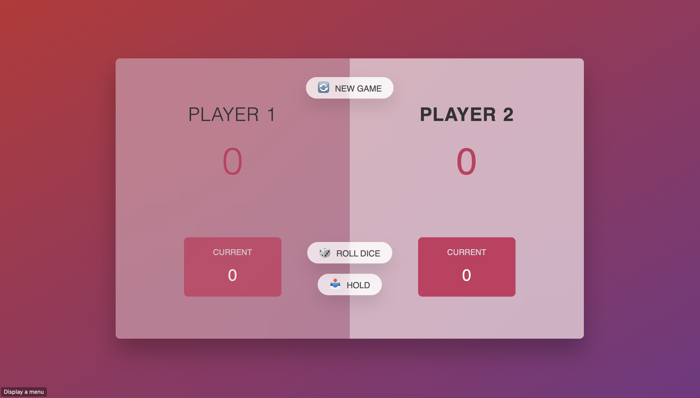

# 🎲 Dice Game

A simple **two-player JavaScript dice game**.

- If a player rolls a **1**, they **instantly lose** that round.
- Otherwise, both players’ rolls are **added up**; the **higher total wins**.
- Ties are possible when the totals match.

---

## 🖼️ Preview
> Replace the image path with your own screenshot or GIF.

---

## ✨ Features
- Two-player dice roll
- Instant loss on rolling **1**
- Highest total wins (otherwise)
- Lightweight: HTML, CSS, JavaScript only

---

## 🕹️ How to Play
1. Click **Roll Dice** to generate two random dice results.
2. If any roll is **1**, that player **loses immediately**.
3. If no one rolled a 1, compare totals — **higher total wins**.
4. Click again to start a new round.

